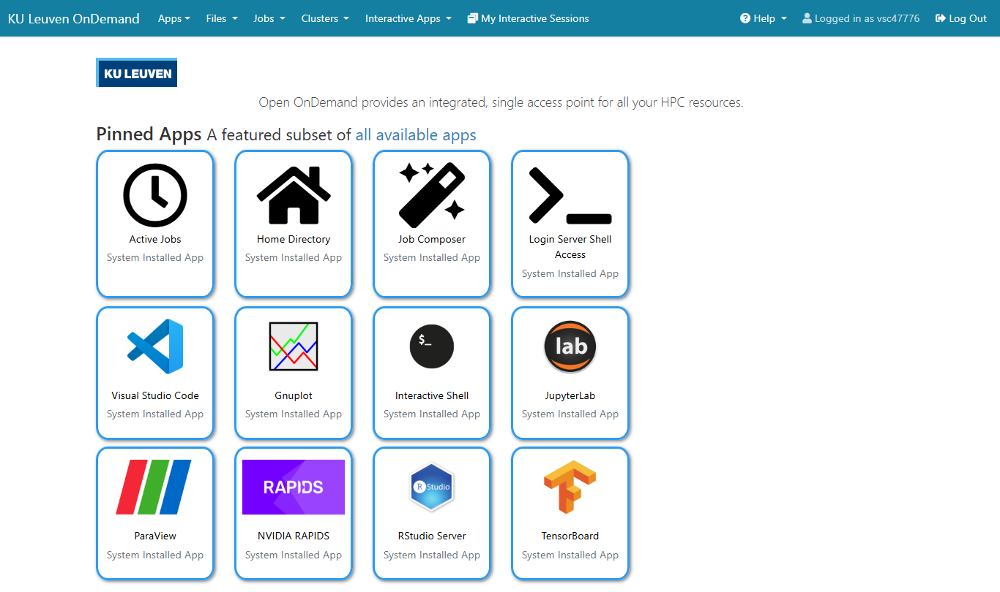

<!--

author:   Bruna Piereck, Boris Depoortere
email:    trainingandconferences@vib.be
version:  1.0.0
language: en
narrator: UK English Female

icon:     https://vib.be/sites/vib.sites.vib.be/files/logo_VIB_noTagline.svg

comment:  This document shall provide an entire compendium and course on the
          development of Open-courSes with [LiaScript](https://LiaScript.github.io).
          As the language and the systems grows, also this document will be updated.
          Feel free to fork or copy it, translations are very welcome...

script:   https://cdn.jsdelivr.net/chartist.js/latest/chartist.min.js
          https://felixhao28.github.io/JSCPP/dist/JSCPP.es5.min.js

link:     https://cdn.jsdelivr.net/chartist.js/latest/chartist.min.css
link:     https://cdnjs.cloudflare.com/ajax/libs/animate.css/4.1.1/animate.min.css
link:     https://raw.githubusercontent.com/vibbits/material-liascript/master/img/org.css
link:     https://cdnjs.cloudflare.com/ajax/libs/font-awesome/5.11.2/css/all.min.css
link:     https://fonts.googleapis.com/css2?family=Saira+Condensed:wght@300&display=swap
link:     https://fonts.googleapis.com/css2?family=Open+Sans&display=swap
link:     https://raw.githubusercontent.com/vibbits/material-liascript/master/vib-styles.css

tutor: TCP
edition: 1st 

-->

# Installations

Please read this page carefully **before** the start of the workshop.

In this session you will find what you need to install in your computer additionally to complementary training material to be completed prior to course.

[Image](https://www.freepik.com/free-vector/website-setup-concept-landing-page_5823714.htm#fromView=search&page=1&position=3&uuid=8e36a5ee-39d5-4073-bfcc-47f4c8a009c0&query=intallation+computer) designed by [Freepik](https://www.freepik.com/)

## 1. You must have Unix command line experience

If you don't have experience or need to refresh your memory, please check our online, self-paced [Introduction to Linux Command Line](https://elearning.vib.be/courses/linux/) course

Some students have reported around 4h of investment in this material, but take your time to get comfortable with the concepts and commands. Think of the folder structure and how to navigate in the computer within a terminal.

[Image](https://www.freepik.com/free-vector/laptop-with-program-code-isometric-icon-software-development-programming-applications-dark-neon_4102879.htm#fromView=search&page=1&position=0&uuid=d5d9c586-a6c9-4476-97a9-ff0ca4dc781d&query=linux) designed by [Fullvector](https://www.freepik.com/author/fullvector) at [Freepik](https://www.freepik.com/)

## 2. Get access to an HPC

Request access to one of the two HPC options in preparation of the course since it might take some time to process and activate. 

### Flemish Supercomputer (VSC)

#### a. Register for an [HPC account](https://docs.vscentrum.be/access/vsc_account.html) 

>
> P.s.: If you are from industry or in any other situation where you are not linked to an academic institution we can only help you get an account when registered in the workshop, check avaiability in [the website](https://www.vibtrainingandconferences.be/#/).
>
> In that case the trainer needs to request a temporary account for you to participate in the training activities.
>

Once you have an account, you can [access it](https://account.vscentrum.be/), and you will be able to see your VSC ID, and other information about your account. Eventually you might want to add an SSH key to connect remotely. You will not need this for this session.

#### b. Test your account:

**connecting at UGent instance of VSC**

Visit [login page](https://login.hpc.ugent.be) , the 1st time you do it permission will be requested to let the web portal access some of your personal information, authorize it!!  Once logged in, you should see this start page!

Once you are logged in, you should see this page:

All good, you can get started!

**connecting at KULeuven instance of VSC**

Visit [login page](https://auth.vscentrum.be/auth/login)  the 1st time you do it permission will be requested to let the web portal access some of your personal information, authorize it!!  Once logged in, you should see this start page!

Once you are logged in, you should see this page:

All good, you can get started!

### VIB Data Core Compute Cluster

Researchers from VIB (and therefor have a `@vib` email address) can follow this course using the VIB Data Core Compute Cluster. 

#### a. Request an account 

If you don't have an account yet, make sure to fill in [this form](https://connect.vib.be/services/command-line-analysis) in advance. See [the page on the Compute Cluster](/chapters/vib_compute) for more details.

#### b. Test your account:

**Connecting to the Compute Cluster**

- To test your command line access, see https://docs.datacore.vib.be/compute-cluster/entrypoints/command-line-access#connect-with-ssh
- To test your access to the web interface of Compute (Open OnDemand), see https://docs.datacore.vib.be/compute-cluster/entrypoints/open-on-demand/

