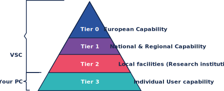

<!--

author:   Tatiana Woller, Bruna Piereck, Alexander Botzki
email:    trainingandconferences@vib.be
version:  1.0.0
language: en
narrator: UK English Female

icon:     https://vib.be/sites/vib.sites.vib.be/files/logo_VIB_noTagline.svg

comment:  This document shall provide an entire compendium and course on the
          development of Open-courSes with [LiaScript](https://LiaScript.github.io).
          As the language and the systems grows, also this document will be updated.
          Feel free to fork or copy it, translations are very welcome...

script:   https://cdn.jsdelivr.net/chartist.js/latest/chartist.min.js
          https://felixhao28.github.io/JSCPP/dist/JSCPP.es5.min.js

link:     https://cdn.jsdelivr.net/chartist.js/latest/chartist.min.css
link:     https://cdnjs.cloudflare.com/ajax/libs/animate.css/4.1.1/animate.min.css
link:     https://raw.githubusercontent.com/vibbits/material-liascript/master/img/org.css
link:     https://cdnjs.cloudflare.com/ajax/libs/font-awesome/5.11.2/css/all.min.css
link:     https://fonts.googleapis.com/css2?family=Saira+Condensed:wght@300&display=swap
link:     https://fonts.googleapis.com/css2?family=Open+Sans&display=swap
link:     https://raw.githubusercontent.com/vibbits/material-liascript/master/vib-styles.css

@orcid: [@0](@1)<!--class="orcid-logo-for-author-list"-->


# WHat is a High-Performance Computing system ?

A HPC brings together several technologies such as computer architecture, algorithms, programs and electronics, and system software to solve advanced problems effectively and quickly. A HPC uses clusters of powerful processors, working in parallel, to process massive multi-dimensional datasets (big data) and solve complex problems at extremely high speeds. HPC systems typically perform at speeds more than one million times faster than the fastest commodity desktop, laptop or server systems. [https://www.ibm.com/topics/hpc].

Among the technologies intergated in a HPC system it can include

**High-end compute nodes:** multicore processors.

**Fast interconnect:** multiple processor cores work together through parallel processing. Fast connections between the nodes are necessary to make quick data exchange possible.

**Parallel shared filesystem:** the compute nodes are connected to a shared filesystem for storing input data, temporary data, and final calculation results.

**High-memory nodes:** some nodes are equipped with lots of RAM memory, mitigating low disk reads impacting analysis that generate large amounts of intermediary results.

**GPU (Graphical processing units) nodes:** are specialized processors, ideally suited for higly demanding data processing tasks.


# Infrastructure

The european model for HPC classifies that different offers in HPC resource and accessibility in different levels called **Tiers**.

_ 



_ 

* **Tier-0** clusters are ***Very large*** computing infrastructure available at EU level, for example [PRACE association](https://prace-ri.eu/prace-association/) (Partnership for advanced computing in Europe) has [6 partners](https://prace-ri.eu/prace-archive/infrastructure-support/prace-hpc-infrastructure/) offering a Tier-0 cluster. Belgium is not hosting a Tier-0 but is one of ~25 member in PRACE.

* **Tier-1** clusters are clusters with services at the level of a region/country because it exceeds the capacity of an institution in terms of needs/costs. For example in the [VSC (Vlaams supercomputer centrum)](https://www.vscentrum.be/compute) there is [Hortense](https://www.vscentrum.be/compute), the Tier-1 computer cluster hosted by UGent university 

* **Tier-2** clusters are available at research institutions level. There are [4 Tier-2 cluster in flandres](https://docs.vscentrum.be/hardware-tier2.html#), hosted bu the universities UAntwerp, VUB, UGent and KULeuven.

* **Tier-3** is representing your personal computer, can be a desktop or a laptop. But is mainly for personal use and has limited resources.

* In **VIB** a HPC cluster is offered by [Data Core](https://datacore.sites.vib.be/en) as a centralized Compute solution. A cluster of computer that will provide multicore processors nodes with higher memory and some GPU nodes. This service is offered only to VIB members.


>> _
>>
>> In this course we will detail more the resources of UGent, KULeuven and VIB instances.
>>
>> However all along we will try to explain the building blocks allowing you easily understand and adapt to other HPC instances.
>>
>> _

## Storage and Computer Nodes systems

A HPC needs different types of storage to maintain the efficience of its vast and complex infrastructure. Each instace will possibly name them differently, but they have defined purposes that you need to take in account when using their environmet. On top of the filesystem, each node will have different computational powers, therefore, depending on your needs, you can choose the one that most suits you.

It means that the files and storage systems in place **will vary**. Knowing this what storages, their purpose and maintanance will be important to understand ***how*** and ***where*** to keep, analyze and backup your data. Additionlly, as you probably already guessed, there is a difference if we are talking about personal use and project wise. Specific projects might request specific resources and will define who can access it.

Generally is good to keep in mind that when you connect to the HPC, the area you start at is like the hall of a house, you should not keep too many things there or do tasks in this location. You will also have a long-term storage, where you can keep your data, but also not where your tasks will be done. Last you will have a temporary large storage place that can be access when using your tasks


<!-- style="color: #7CA1CC;" --> \** Storage space for a group of users (Virtual Organisation or VO for short) in VSC can be increased significantly on request, check for [more information](https://docs.vscentrum.be/gent/tier1_hortense.html#system-specific-aspects) if you need.


### VIB cluster specs

To be added

### UGent instances of the VSC

At the UGent system you will have 4 storages with different purposes


| Filesystem name  | Intended usage | Personal storage space | VO storage space **|
| ------------- | ------------- | ------------- | ------------- |
| $VSC_HOME | Home directory | 3GB (fixed) | :x: |
| $VSC_SCRATCH | Entry point to the system |  3GB (fixed) | :x: |
| $VSC_DATA | Long-term storage of large data files |  Depend of you account(Leuven/Gent, see above) | :x: |
| $VSC_SCRATCH_PROJECTS_BASE/2024_300/| Temporary fast storage of ‘live’ data for calculations |  20TB | upon request |

Tier-2 instance of UGent 
-------------------------

You can find more details about the [UGent instance](https://docs.vscentrum.be/gent/tier2_hardware.html) but we try to summarize some aspects here. Keep in mind that most updated information will be found in the links. 

These are the nodes available at Tier-2 UGent and you can see tehy will vary in memory, disk space and if they have or not GPUs. I want you to pay special attention to [**donphan**](https://docs.hpc.ugent.be/Linux/interactive_debug/), this is the debug and testing node, is also the one using during training sessions.


| Cluster name  | Memory (GiB) | Disk space  |  GPU |
|---|---|---|---|
| swalot | 116 | 1 TB | - |
| skitty | 177 | 1 TB + 240 GB SSD | - |
| victini | 88 | 1 TB + 240 GB SSD | - |
| joltik | 256 | 800 GB SSD | 4 NVIDIA V100 |
| doduo | 250 | 180 GB SSD | - |
| accelgor | 500 | 180 GB SSD | 4 NVIDIA A100 |
| donphan ** | 738 | 1.6 TB NVME | 1 shared NVIDIA Ampere A2 |
| gallade | 940 | 1.5 TB NVME | - |


Tier-1 instance of UGent
-------------------------

You can find more details about the Tier1 of the [VCS ](https://www.vscentrum.be/), but we try to summarize some aspects here. Keep in mind that most updated information will be found in the links. In the Tier-1 instace, additionally to the nodes listed bellow you can request 2 other nodes that are a combination for high demand analysis; **(1)** `cpu_rome_all` corresponds to a combination of `cpu_rome` and `cpu_rome_512`; **(2)** `gpu_rome_a100_all` corresponds to a combination of `gpu_rome_a100_40` and `gpu_rome_a100_80`.

| Cluster name  | Memory (GiB) | Disk space (GB) SSD  |  GPU | GPU memory (GiB)|
|---|---|---|---|---|
| cpu_rome | 256 | 480 | - | - |
| cpu_rome_512| 512 | 480 | - | - |
| cpu_milan | 256 |480| - | - |
| gpu_rome_a100_40| 256 | 480 | 4 NVIDIA A100  | 40 |
| gpu_rome_a100_80 | 512 | 480 | 4 NVIDIA A100  | 80 |
| debug_rome ** | 256| 100 | 1 NVIDIA Quadro P1000 | 4|

for more information in different partitions: [vscentrum.be general-information](https://docs.vscentrum.be/en/latest/gent/tier1_hortense.html#general-information)


****************************************************

           {{1}}
****************************************************

Check the quota
---------------------

<!-- style="color: magenta" 
#### UGent TIER 1

`my_dodrio_quota`

```
Userquota:
Disk quotas for prj 2534840 (pid 2534840):
     Filesystem    used   quota   limit   grace   files   quota   limit   grace
        /dodrio  1.709G   2.85G      3G       -   24566  1048576 1048576       -

Quota for project gpr_compute_2024_300:
Disk quotas for prj 2641240 (pid 2641240):
     Filesystem    used   quota   limit   grace   files   quota   limit   grace
        /dodrio   15.4T     19T     20T       -  739564  1048576 1048576       -
```

On Tier1, `my_dodrio_quota` give the space available on the `$VSC_SCRATCH` (first result) and on the one on our project (in that case `/dodrio/scratch/projects/2024_300/`)

---------------------------------------------------------

****************************************************

#### UGent TIER 2

 `show_quota` or go to https://account.vscentrum.be for a general overview

           {{0}}
****************************************************

Filesystems specifics
---------------------------

| Filesystem name  | Intended usage | Total storage space | Personal storage space | VO storage space (*)|
| ------------- | ------------- | ------------- | ------------- | ------------- |
| $VSC_HOME | Home directory, entry point to the system | 51 TB | 3GB (fixed) | :x: |
| $VSC_DATA | Long-term storage of large data files | 1.8 PB | 25GB (fixed) | 250GB |
| $VSC_SCRATCH | Temporary fast storage of ‘live’ data for calculations | 1.9 PB | 25GB (fixed) | 250GB |
| $VSC\_SCRATCH\_ARCANINE | Temporary very fast storage of ‘live’ data for calculations (recommended for very I/O-intensive jobs) | 70 TB  | (none) | upon request |
(*) Storage space for a group of users (Virtual Organisation or VO for short) can be increased significantly on request.

Source : https://docs.vscentrum.be/en/latest/gent/tier2_hardware.html?highlight=VSC_DATA#shared-storage

----------------------------------------------

********************************************************************************

### KULeuven section of the VSC

If for your training session you are using the [KULeuven section](https://docs.vscentrum.be/leuven/genius_quick_start.html#access-to-the-cluster) of the [Flemish Supercomputing Center](https://www.vscentrum.be/), it's very likely that your group is in a list of people with priorities for a reserved cluster. As you read this you can imagine that there is not only cluster option you can use. Different clusters will have different computational powers, therefore, depending on what you will do you can choose the one that most suits you.

Overview KULeuven-VSC 
-------------

<!-- style="color: magenta" --> To update


| Tier  | Login (vscnumber) | Personal storage space | VO Storage Space |  VO Project space |
| ------------- | ------------- | ------------- | ------------- | ------------- |
|Tier 2 Leuven | login.hpc.kuleuven.be |yes|yes| none|

Clusters specifics at KULeuven - VSC
-----------------------------------

#### Tier 2 KUL Genius

| Cluster name | Memory (GiB) | Disk space  | GPU | GPU memory (GiB)|
|---|---|---|---|---|
| batch/batch_long | 192 | 200 GB SSD | - | -|
| interactive | 192 | 200 GB SSD | - | -|
| bigmem| 768 | 200 GB SSD | - | - |
| gpu_p100 | 192 | 200 GB SSD | 4 NVIDIA P100 |16|
| GPU_v100 | 768 | 200 GB SSD | 8 NVIDIA V100 | 32|
|amd| 256 | 200 GB SSD | - |-|

-----------------------------------------------

####  Tier 2 KUL wICE

| Cluster name | Memory (GiB) | Disk space  | GPU | GPU memory (GiB)|
|---|---|---|---|---|
| batch/batch_long | 256 | 960 GB SSD | - | -|
| batch_sapphirerapids/batch_sapphirerapids_long| 256 | 960 GB SSD | - | -|
| bigmem | 256 | 2048 GB SSD | - | - |
| hugemem | 960 | 8000 GB SSD | - | -|
| gpu | 512| 960 GB SSD | 4 NVIDIA A100 SXM4 | 80 |
| gpu_h100 | 768 | 960 GB SSD | 4 NVIDIA H100 | 80|
| interactive and gpu_a100_debug | 512| 960 GB SSD | 1 NVIDIA A100 | 80 |


           {{0}}
****************************************************

Filesystems specifics
---------------------------

| Filesystem name  | Intended usage | Total storage space | Personal storage space | VO storage space (*)|
| ------------- | ------------- | ------------- | ------------- | ------------- |
| $VSC_HOME | Home directory, entry point to the system | ? | 3GB (fixed) | :x: |
| $VSC_DATA | Long-term storage of large data files | ? | 75GB (fixed) | :x: |
| $VSC_SCRATCH | Temporary fast storage of ‘live’ data for calculations | ? | 500GB | ? |

<!-- style="color: magenta" --> What do we need the below info? (Bruna - check if there is the same for UGent)

| Variable | Name | 
| ------------- | ------------- |
| $VSC_HOME | /user/leuven/30X/vsc30XYZ | 
| $VSC_DATA | /data/leuven/30X/vsc30XYZ|
| \$VSC_SCRATCH **or** \$VSC\_SCRATCH\_SITE | /scratch/leuven/30X/vsc30XYZ |
| $VSC\_SCRATCH\_NODE | /local_scratch |

> Source : https://docs.vscentrum.be/en/latest/leuven/tier2_hardware/kuleuven_storage.html?highlight=VSC_DATA#ku-leuven-storage

-----------------------------------------------------------------

****************************************************

           {{1}}
****************************************************

Projects and reservation for Tier-2 KU Leuven
-----------------------------------------------

Running calculations on Tier-2 KU Leuven requires credits. New users obtained 2 millions free credits (introduction) that are valid during 6 months.
Credits can be obtained through various type of research projects (through university, FWO, EU level). Subset of Tier-2 KUL can be reserved for research events or training events.

-------------------------------------------------

# Connecting to use HPC services

## Connect with Open OnDemand

### Tier 2 KUL
- How to connect: https://ondemand.hpc.kuleuven.be/ 
- Which services are available: code-server, shell, jupyterlab, nvidia rapids, RStudio Server, Tensorboard

### Tier 2 UGent
- How to connect: https://login.hpc.ugent.be
- Which services are available: BAND, Neurodesk, Cluster Desktop, shell, Jupyter Notebook, RStudio, Jupyter Lab, VS Code Tunnel, Code server

### Tier1 compute
- How to connect: https://tier1.hpc.ugent.be/ 
- Which services are available: BAND, Neurodesk, Cluster Desktop, Shell, Jupyter Notebook, RStudio, Jupyter Lab, VS Code Tunnel
  
### VIB cluster
- How to connect:
- - Which services are available: Shell, Jupyter Notebook, RStudio, Jupyter Lab, VS Code Tunnel

## Connect with a Terminal

### Creat and share SSH key 


<!-- style="color: magenta" --> VO = virtual organization

| Tier  | Login (vscnumber) | Personal storage space | VO Storage Space |  VO Project space |
| ------------- | ------------- | ------------- | ------------- | ------------- |
|Tier 1 | tier1.hpc.ugent.be |yes|yes|yes|
|Tier 2 Ghent | login.hpc.ugent.be |yes|yes|none|