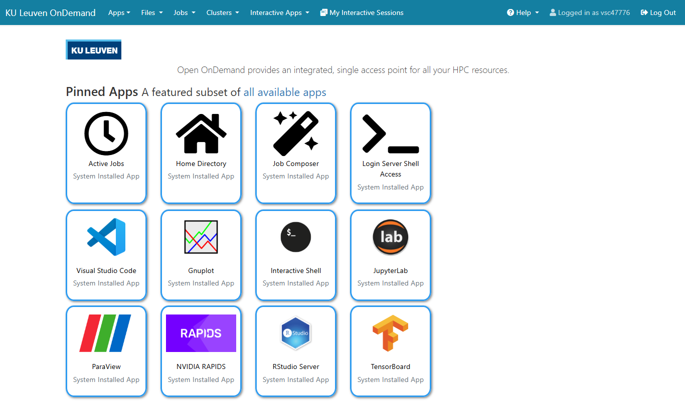
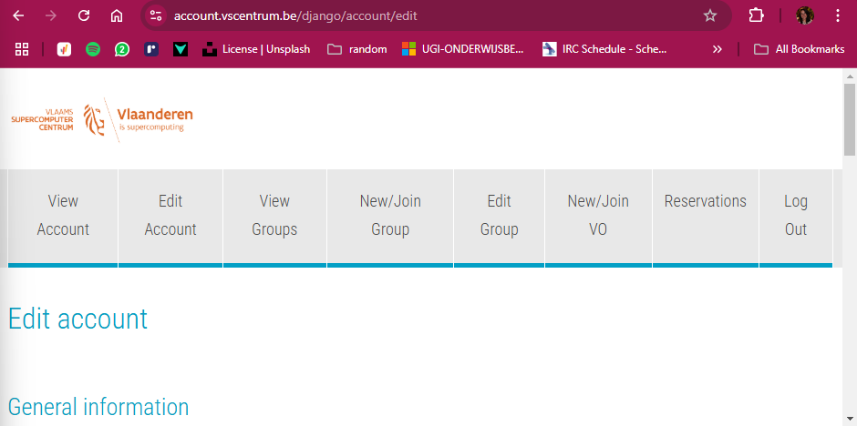

<!--

author:   Tatiana Woller, Bruna Piereck, Alexander Botzki, Benjamin Pavie
email:    trainingandconferences@vib.be
version:  1.0.0
language: en
narrator: UK English Female

icon:     https://vib.be/sites/vib.sites.vib.be/files/logo_VIB_noTagline.svg

comment:  This document shall provide an entire compendium and course on the
          development of Open-courSes with [LiaScript](https://LiaScript.github.io).
          As the language and the systems grows, also this document will be updated.
          Feel free to fork or copy it, translations are very welcome...

script:   https://cdn.jsdelivr.net/chartist.js/latest/chartist.min.js
          https://felixhao28.github.io/JSCPP/dist/JSCPP.es5.min.js

link:     https://cdn.jsdelivr.net/chartist.js/latest/chartist.min.css
link:     https://cdnjs.cloudflare.com/ajax/libs/animate.css/4.1.1/animate.min.css
link:     https://raw.githubusercontent.com/vibbits/material-liascript/master/img/org.css
link:     https://cdnjs.cloudflare.com/ajax/libs/font-awesome/5.11.2/css/all.min.css
link:     https://fonts.googleapis.com/css2?family=Saira+Condensed:wght@300&display=swap
link:     https://fonts.googleapis.com/css2?family=Open+Sans&display=swap
link:     https://raw.githubusercontent.com/vibbits/material-liascript/master/vib-styles.css

@orcid: [@0](@1)<!--class="orcid-logo-for-author-list"-->


# Request an account

You can see how to request a VSC account in [chapter02](../chapters/02_GetReady4course.md#a-register-for-an-hpc-account).

To request an account at VIB, checkout [the following section in chapter02](../chapters/02_GetReady4course.md#a-request-an-account).

# Connecting to use HPC services

You have different ways to connect and access the resources of the HPC. You can use your browser and connect using OnDemand or you connect from your local computer using SSH key credentials. We will see how to use both.

The OnDemand service allows a friendly interface to be used in your browser. It is specially interesting if you need to have images, visuals or wants to use Jupyter.  As you can already guess, not every instance offers the same service, so you need to check if the instance you are connecting to has what you are expecting to use.

For the case of using OnDemand you don't need an SSH-key, however to access from your computer terminal you will need to create an SSH-key, which works as an address to your computer, allowing the communication with remote machines. It is essential that you remember this is an address that gives access to you computer, so when you do think of a good password. I'll give you more details in the specific session.

## Connect with Open OnDemand

Once you are logged in on one of the HPC instances using OnDemand you can find a list of interactive apps that can include Jupyter notebook, RStudio, VSCode Tunnel among others. 

<center></center>

You will also find a shortcut for their terminal cluster. You can open the terminal in your home directory (also known as `$HOME` or `~`) or request an interactive session in one specific node that contains the resources you need. Before we get into this level, let's see how we can connect to OnDemand.

* VIB Data Core Compute Cluster: https://compute.vib.be/

* UGent Tier-1: https://tier1.hpc.ugent.be/ 

* UGent Tier-2: https://login.hpc.ugent.be

* KULeuven Tier-2: https://ondemand.hpc.kuleuven.be/ 

Each link will take you to enter with the account you registered with and will follow the procedures described in chapter02: [Get Ready for the course](../chapters/02_GetReady4course.md).

Once you are connected you will find the menu bar on top where you have **Interactive APPs** and you can check what each instance has to offer. See for example in UGent Tier-2:

<center></center>

Print from march-2025.

Once you choose the app you will need to define the resources you need. You can do that by informing the Cluster name, to be sure you should check the documentation since the summary in chapter03: [Infrastructure](../chapters/03_Infrastructure.md) could be outdated. You also have to define for how many hours, cores and memory you need for this session.

<center></center>

Print from march-2025.

When you do so, there is a high chance that you will go into a waiting line. The resources are not always immediately available. Despite of sometimes having the feeling that it is an infinite resource, it could have a high demand. 

The more resources you request, the longer is the waiting time usually, also if you request very often you could lose some priority. Thus, be mindful.

If you are in a training session ask your trainer what resources you need to request and if there is a priority list for the course. In the case of a priority list, the trainer will share a priority code that you will include in the specs so your waiting time is smaller.

If you go to **My interactive sessions** in the menu bar you will be redirect to a page with the list of resources and will follow the same step-by-step procedure.

>
> For this session, let's connect with VSCode
> Activity:
>
>

## Connect with a Terminal

To work from the terminal the first thing you are going to need is to create an authenticated connection between your machine and the HPC. Yes! We are talking about the SSH-key. As I said before the SSH-key is like an address that will allow communication between your computer and the computer cluster.

That is important to keep in mind due some implications, first of all for this to be a safe connection you will create a strong password when you are asked during the procedure. Second, it means sharing this key, you will generate two keys and you can only share the public key, that is the one meant for sharing. Third, this means for each computer you will have a different one; So, if you are using your working computer and your personal computer it means following the steps in each of them.

How you can generate this key is a bit different for each operational system. Check which one you need.

## Create SSH key

On Windows
-------------------------------

For Windows system you have two ways to do it.

1. Using [PuTTY](https://www.chiark.greenend.org.uk/~sgtatham/putty/latest.html) app. And for all details please [check on VSC](https://docs.vscentrum.be/access/generating_keys_with_putty.html#generating-keys-putty) and how they advise you to do it.


### Putty setting


On MAC and Linux, using OpenSSH
-------------------------------
 
 First check if you already have a key

 ```
 $ ls ~/.ssh
 authorized_keys   id_rsa   id_rsa.pub   known_hosts
 ```

If you have one, like in the example above you can share you SSH-key with VSC. If you don't have then you need to follow the steps:

```
$ ssh-keygen -t rsa -b 4096
Generating public/private rsa key pair.
```

Don't change the name of the file that is being created, but make sure to have a strong password. You will not see any symbols while typing the password! But this is standard behavior of unix systems to protect you from people even knowing how many characters there are in your password. Trust the process and repeat the same password twice

```
Enter file in which to save the key (/home/bruna/.ssh/id_rsa): 
Enter passphrase (empty for no passphrase): 
Enter same passphrase again:
```

Check again and you should see one `id_rsa` and one `id_rsa.pub`, the second one is your **pub**lic key. That is the one you need to share with VSC or VIB clusters.

you can print then so you can copy-past

```
$ cat ~/.ssh/id_rsa.pub
ssh-rsa AA...........................
.....................................
.....................................
.....................................
....................bruna@DESKTOP....
```

You will see something like this. Starting with ssh-rsa followed by several characters that were **replaced** by points, and the name of your computer. If you see in the first line `--BEGIN OPENSSH PRIVATE KEY--`, go back! This file data should **NOT** be shared. 

if you want more details check the [VSC documetation](https://docs.vscentrum.be/access/generating_keys_with_openssh.html#generating-keys-linux)

## Share the SSH public key 

Different HPC center around the globe might give you different directions. It could be done on the command line or by sharing in a centralized page or using apps as PuTTY. 

This bit is important because it is used for authorization and giving directions so communication can be established to the remote connection.

VIB procedure
-------------------------
The VIB Single Sign-on (SSO) is leveraged through a program called Smallstep. Installation procedures can be found in [the Data Core documentation](https://docs.datacore.vib.be/compute-cluster/entrypoints/command-line-access/#installing-smallstep). 

VSC procedure
-------------------------

For all instances of VSC you have a centralized control. That means that once you have done it for VSC you can use the same credentials and same account to connect to Tier-1 and Tier-2 of UGent, KULeuven and others.

So far you have created an account, you have created the SSH-key, now you need to access the [vsc account webpage](https://account.vscentrum.be/), you will find a top bar menu. 

<center></center>

Print from march-2025.

If you go to the tab **Edit Account** and scroll down, you will find the option **Add public key**


In the **View Account** tab you will find information about your account, among these you will know your VSC-Uid that has a format as **vsc00000**, you might be requested to share this ID in order to be added to a project or priority list of a training session. You will also find the path to your `$HOME`, `$DATA` and `$SCRATCH` directory that is linked to your institution, in my case is UGent.

**Home directory: /user/gent/000/vsc00000**
**Data directory: /data/gent/000/vsc00000**
**Scratch directory: /scratch/gent/000/vsc00000**


