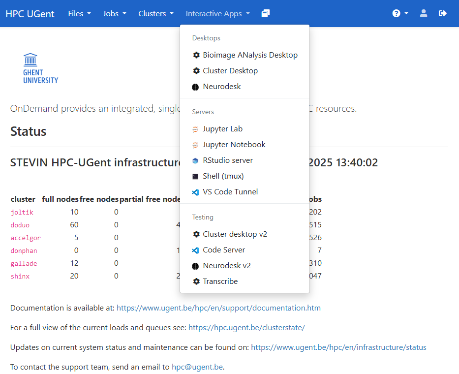
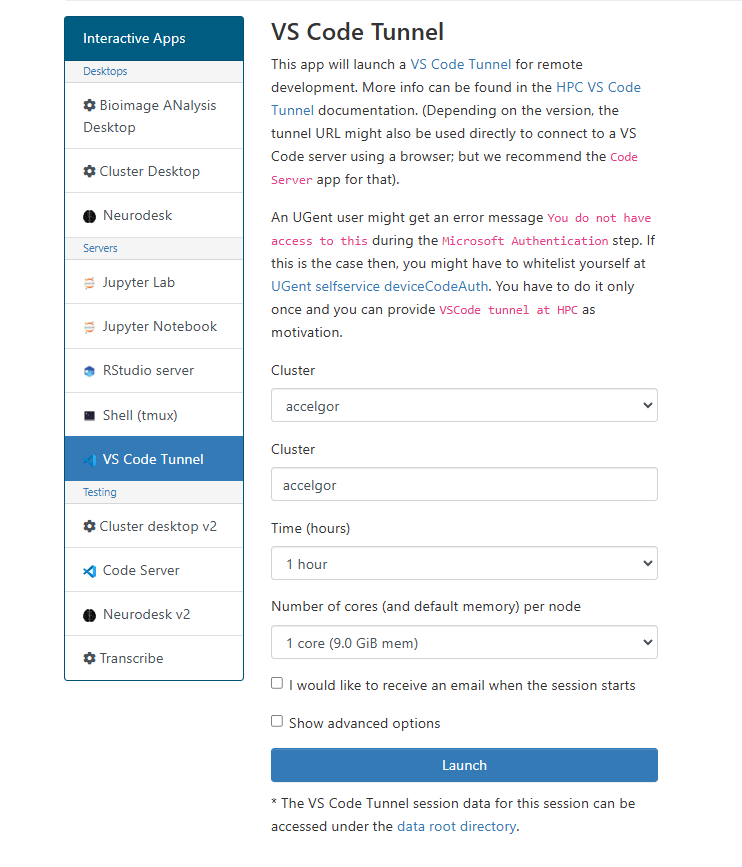

<!--

author:   Tatiana Woller, Bruna Piereck, Alexander Botzki
email:    trainingandconferences@vib.be
version:  1.0.0
language: en
narrator: UK English Female

icon:     https://vib.be/sites/vib.sites.vib.be/files/logo_VIB_noTagline.svg

comment:  This document shall provide an entire compendium and course on the
          development of Open-courSes with [LiaScript](https://LiaScript.github.io).
          As the language and the systems grows, also this document will be updated.
          Feel free to fork or copy it, translations are very welcome...

script:   https://cdn.jsdelivr.net/chartist.js/latest/chartist.min.js
          https://felixhao28.github.io/JSCPP/dist/JSCPP.es5.min.js

link:     https://cdn.jsdelivr.net/chartist.js/latest/chartist.min.css
link:     https://cdnjs.cloudflare.com/ajax/libs/animate.css/4.1.1/animate.min.css
link:     https://raw.githubusercontent.com/vibbits/material-liascript/master/img/org.css
link:     https://cdnjs.cloudflare.com/ajax/libs/font-awesome/5.11.2/css/all.min.css
link:     https://fonts.googleapis.com/css2?family=Saira+Condensed:wght@300&display=swap
link:     https://fonts.googleapis.com/css2?family=Open+Sans&display=swap
link:     https://raw.githubusercontent.com/vibbits/material-liascript/master/vib-styles.css

@orcid: [@0](@1)<!--class="orcid-logo-for-author-list"-->


# Connecting to use HPC services

You have different ways to connect and access the resources of the HPC. You can use your browser and connect using OnDemand or you connect from your local computer using SSH key credentials. We will see how to use both.

The OnDemand service allowns a friendly interface to be used in your browser. It is specially interesting if you need to have images, visuals or wants to use Jupyter.  As you can already guess, not every instance offers the same service, so you need to check if the instance you are connecting to has what you are expecting to use.

For the case of using OnDemand you don't need an SSH-key, however to access from your computer terminal you will need to creat an SSH-key, which works as an adress to your computer, allowing the communication with remote machines. It is essential that you remember this is an adress that gives access to you computer, so when you do think of a good password. I'll give you more details in the specific session.

## Connect with Open OnDemand

Once login in one of the HPC instances usign OnDemand you can find a list of Interactive apps that can include Jupyter notebook, RStudio, VSCode Tunnel among others. 

MISSING IMAGE
<center></center>

You will find also a shortcut for ther terminal cluster. You can open the terminal in your HOME directory or request an interactive session in one specific node that contains the resources you need. Before I get into this level, let's see how we connect to OnDemand.

* VIB cluster: 

* UGent Tier-1: https://tier1.hpc.ugent.be/ 

* UGent Tier-2: https://login.hpc.ugent.be

* KULeuven Tier-2: https://ondemand.hpc.kuleuven.be/ 

Each link will take you to enter with the account you registeres and will follow the procedures described in chaper02: [Get Ready for the course](../chapters/02_GetReady4course.md).

Once you are connected you will find the menu bar on top where you have **Interactive APPs** and you can check what each instace has to offer. See for example in UGent Tier-2:

<center></center>

Print from march-2025.

Once you choose the app you will need to define the resources you need. You that by informing the Cluster name, to be sure youshould check the documentation since the summary in chapter03: [Insfrastucture](../chapters/03_Infrastructure.md) could be outdated. You also have to define for how many hours, cores and memory you need for this session.

<center></center>

Print from march-2025.

When you do so, there is a high chance that you will go into a wating line. The resources are not always imediatly available. Inspite of sometimes the feeling that is an infinit resource, it could have a high demand. 

The more resources you request, the longer is the waiting time usually, also if you request very often you could lose some priority. Thus, be mindful.

If you are in a training session ask your trainer what resources you need to request and if there is a priority list for the course. In the case of a priority list, the trainer will share a piority code that you will include in the specs so your waiting time is smaller.

If you go to **My interactive sessions** in the menu bar you will be redirect to a page with the list of resources and will follow the same step-by-step procedure.

>
> For this session, let's connect with VSCode
> Activity:
>
>

## Connect with a Terminal

### Creat and share SSH key 


<!-- style="color: magenta" --> VO = virtual organization

| Tier  | Login (vscnumber) | Personal storage space | VO Storage Space |  VO Project space |
| ------------- | ------------- | ------------- | ------------- | ------------- |
|Tier 1 | tier1.hpc.ugent.be |yes|yes|yes|
|Tier 2 Ghent | login.hpc.ugent.be |yes|yes|none|


****************************************************

           {{1}}
****************************************************

Check the quota
---------------------

<!-- style="color: magenta" 
#### UGent TIER 1

`my_dodrio_quota`

```
Userquota:
Disk quotas for prj 2534840 (pid 2534840):
     Filesystem    used   quota   limit   grace   files   quota   limit   grace
        /dodrio  1.709G   2.85G      3G       -   24566  1048576 1048576       -

Quota for project gpr_compute_2024_300:
Disk quotas for prj 2641240 (pid 2641240):
     Filesystem    used   quota   limit   grace   files   quota   limit   grace
        /dodrio   15.4T     19T     20T       -  739564  1048576 1048576       -
```

On Tier1, `my_dodrio_quota` give the space available on the `$VSC_SCRATCH` (first result) and on the one on our project (in that case `/dodrio/scratch/projects/2024_300/`)

---------------------------------------------------------
for your training session you are using the [KULeuven section](https://docs.vscentrum.be/leuven/genius_quick_start.html#access-to-the-cluster)

Overview KULeuven-VSC 
-------------

<!-- style="color: magenta" --> To update


| Tier  | Login (vscnumber) | Personal storage space | VO Storage Space |  VO Project space |
| ------------- | ------------- | ------------- | ------------- | ------------- |
|Tier 2 Leuven | login.hpc.kuleuven.be |yes|yes| none|

Clusters specifics at KULeuven - VSC
-----------------------------------